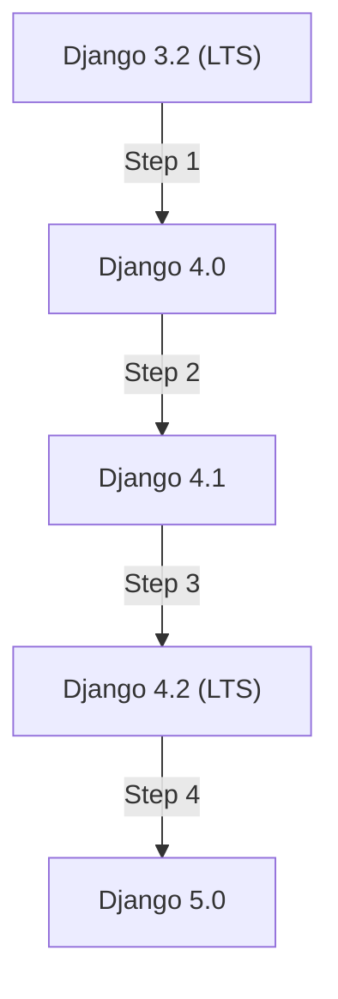

# The Django Upgrade Playbook: Migrating Production Apps Without Downtime

Upgrading the framework version of a live production application is often met with hesitation. When that framework is Django — carrying your ORM, authentication system, middleware, and admin site — the hesitation is justified. 

However, running on outdated Django versions exposes your application to security vulnerabilities and denies you access to performance improvements like async ORM operations, enhanced database constraint features, and developer ergonomics.

This playbook outlines a battle-tested pipeline for upgrading Django in large-scale applications with zero downtime.

---

## The Upgrade Process Pipeline

Upgrading Django is not a single command; it is a progressive transition. Jumping directly across multiple major releases (e.g. from `3.2` directly to `5.0`) guarantees broken migrations and failing imports. Instead, follow the staged pipeline below:


---

## Phase 1: The Deprecation Warning Audit

Django is highly disciplined about deprecations. Before any feature is removed in version `N`, it raises deprecation warnings in version `N-1`. 

To surface these warnings, run your test suite with deprecation warnings enabled:

```bash
python -Wd manage.py test
```

Or, if you use `pytest`, configure it in your `pytest.ini`:

```ini
[pytest]
filterwarnings =
    d
    ignore::UserWarning
```

Look specifically for `RemovedInDjangoXXWarning`. These highlight the exact lines in your code that will break in the next version. Common deprecations include:
- Changes to default auto-increment primary keys (`DEFAULT_AUTO_FIELD`).
- The removal of legacy functional wrappers in favor of class-based options.
- Argument shifts in database connection configurations and middleware classes.

Fix these warnings **while still running your current Django version**.

---

## Phase 2: Aligning Third-Party Dependencies

The most common blocker for upgrading Django isn't Django itself — it's third-party packages (e.g., `django-cors-headers`, `django-debug-toolbar`, or custom authentication providers) that have not yet declared support for the newer version.

Before upgrading Django:
1. Generate your dependency tree: `pip depth` or examine `poetry.lock`.
2. Inspect package releases. Upgrade all third-party Django apps to their latest versions.
3. If a package is unmaintained and incompatible with the target Django version, look for active forks or replace it with native middleware/utilities.

---

## Phase 3: The Multi-Step Upgrade Path

If you are upgrading across multiple versions, you must upgrade **one minor/LTS version at a time**. 

For example, if your application is on Django `3.2` and your goal is `5.0`:



At each step along this path:
1. Update your dependency constraints (e.g. `django>=4.2,<4.3` in `requirements.txt`).
2. Run `python manage.py check` to catch initial settings issues.
3. Run the unit test suite and ensure 100% pass rates.
4. Commit, deploy to your staging environment, and run integration tests.
5. Deploy to production, monitor errors, then proceed to the next version step.

---

## Phase 4: Zero-Downtime Database Migrations

Database migrations are the riskiest part of any framework upgrade. Django's ORM changes between versions can alter how SQL migrations are generated.

### The Safe Migration Golden Rules
- **Separate migrations from code upgrades**: Never run new, complex business logic migrations in the same deployment window where you upgrade the Django version.
- **Run migrations first**: Apply any pending migrations generated under the old Django version *before* deploying code running the new Django version.
- **Avoid heavy schema alterations**: Adding columns with default values, renaming tables, or creating complex indexes should be done in separate, isolated pull requests before the framework upgrade.

---

## Phase 5: Production Deployment and Rollout

When deploying the upgraded Django version to production, utilize a **Blue/Green (Staged) deployment**:

1. **Deploy New Nodes**: Spin up new containers/instances running the upgraded Django code.
2. **Health Check Validation**: Verify that the new nodes pass automated health checks (checking endpoints that touch the database, cache, and external APIs).
3. **Canary Load Shift**: Shift 5% of production traffic to the new nodes. Monitor error tracking software (e.g., Sentry) for a 15-minute window.
4. **Full Rollout**: Shift the remaining 95% of traffic to the new nodes and decommission the old instances.

By following this incremental, warning-driven upgrade pipeline, you can comfortably keep your Django stack modern, secure, and fast without interrupting service for your users.
